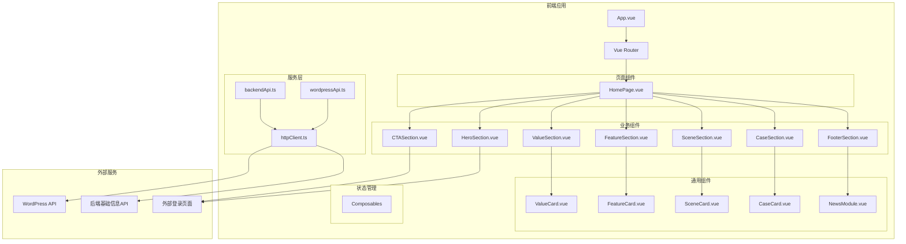

# Design Document: 星扣AR创作平台·教育版首页

## Overview

本设计文档描述了"星扣AR创作平台·教育版"首页的技术架构和实现方案。项目采用Vue 3 + TypeScript + Element Plus技术栈，构建一个响应式的单页应用，集成WordPress API和后端基础信息API。

### 技术栈

- **框架**: Vue 3 (Composition API)
- **UI库**: Element Plus
- **语言**: TypeScript
- **构建工具**: Vite
- **样式**: SCSS + Element Plus主题定制
- **HTTP客户端**: Axios

## Architecture



## Components and Interfaces

### 目录结构

```
src/
├── assets/
│   ├── images/
│   └── styles/
│       ├── variables.scss
│       └── global.scss
├── components/
│   ├── common/
│   │   ├── ValueCard.vue
│   │   ├── FeatureCard.vue
│   │   ├── SceneCard.vue
│   │   ├── CaseCard.vue
│   │   └── NewsModule.vue
│   └── sections/
│       ├── HeroSection.vue
│       ├── ValueSection.vue
│       ├── FeatureSection.vue
│       ├── SceneSection.vue
│       ├── CaseSection.vue
│       ├── CTASection.vue
│       └── FooterSection.vue
├── composables/
│   ├── useNews.ts
│   └── useBaseInfo.ts
├── services/
│   ├── httpClient.ts
│   ├── wordpressApi.ts
│   └── backendApi.ts
├── types/
│   └── index.ts
├── views/
│   └── HomePage.vue
├── App.vue
└── main.ts
```

### 组件接口定义

#### HeroSection.vue

```typescript
// Props
interface HeroSectionProps {
  title: string
  subtitle: string
  primaryButtonText: string
  secondaryButtonText: string
  highlights: string[]
  loginUrl: string
}

// Emits
interface HeroSectionEmits {
  (e: 'scrollToCase'): void
}
```

#### ValueCard.vue

```typescript
interface ValueCardProps {
  icon: string
  title: string
  description: string
}
```

#### FeatureCard.vue

```typescript
interface FeatureCardProps {
  icon: string
  title: string
  description: string
}
```

#### SceneCard.vue

```typescript
interface SceneCardProps {
  subject: string
  image: string
  description: string
}
```

#### CaseCard.vue

```typescript
interface CaseCardProps {
  schoolName: string
  description: string
  image?: string
  tags?: string[]
}
```

#### NewsModule.vue

```typescript
interface NewsModuleProps {
  news: NewsItem[]
  loading: boolean
  error: string | null
}

interface NewsModuleEmits {
  (e: 'retry'): void
}
```

### 服务层接口

#### httpClient.ts

```typescript
interface HttpClientConfig {
  baseURL: string
  timeout: number
}

interface HttpClient {
  get<T>(url: string, params?: Record<string, any>): Promise<T>
  post<T>(url: string, data?: any): Promise<T>
}
```

#### wordpressApi.ts

```typescript
interface WordPressApiService {
  getNews(params?: NewsQueryParams): Promise<NewsItem[]>
  getCategories(): Promise<NewsCategory[]>
}

interface NewsQueryParams {
  page?: number
  perPage?: number
  categories?: number[]
}
```

#### backendApi.ts

```typescript
interface BackendApiService {
  getBaseInfo(): Promise<BaseInfo>
}
```

## Data Models

### 核心数据类型

```typescript
// 新闻相关
interface NewsItem {
  id: number
  title: string
  excerpt: string
  content: string
  date: string
  link: string
  category: NewsCategory
  featuredImage?: string
}

interface NewsCategory {
  id: number
  name: string
  slug: string
}

// 基础信息
interface BaseInfo {
  siteName: string
  loginUrl: string
  contactInfo: ContactInfo
  copyright: string
}

interface ContactInfo {
  phone?: string
  email?: string
  wechat?: string
}

// 页面内容配置
interface ValueItem {
  icon: string
  title: string
  description: string
}

interface FeatureItem {
  icon: string
  title: string
  description: string
}

interface SceneItem {
  subject: string
  image: string
  description: string
}

interface CaseItem {
  schoolName: string
  description: string
  image?: string
  tags?: string[]
}

// 页面配置
interface PageConfig {
  hero: {
    title: string
    subtitle: string
    primaryButton: string
    secondaryButton: string
    highlights: string[]
  }
  values: ValueItem[]
  features: FeatureItem[]
  scenes: SceneItem[]
  cases: CaseItem[]
  footer: {
    navigation: FooterNavGroup[]
  }
}

interface FooterNavGroup {
  title: string
  links: FooterLink[]
}

interface FooterLink {
  text: string
  url: string
}
```


## Correctness Properties

*A property is a characteristic or behavior that should hold true across all valid executions of a system—essentially, a formal statement about what the system should do. Properties serve as the bridge between human-readable specifications and machine-verifiable correctness guarantees.*


基于需求分析，以下是可测试的正确性属性：

### Property 1: Card Component Rendering

*For any* card component (ValueCard, FeatureCard, SceneCard, CaseCard) with valid props, the rendered output SHALL contain all required fields (icon/image, title/name, description).

**Validates: Requirements 2.3, 3.3, 4.3, 5.3**

### Property 2: News List Rendering

*For any* valid array of NewsItem objects, the NewsModule SHALL render exactly the same number of news items as provided in the array, with each item displaying its title and excerpt.

**Validates: Requirements 8.2**

## Error Handling

### API错误处理策略

```typescript
// 统一错误处理
interface ApiError {
  code: string
  message: string
  details?: any
}

// 错误处理流程
const handleApiError = (error: ApiError, fallback: any) => {
  console.error(`API Error [${error.code}]: ${error.message}`)
  // 返回降级数据
  return fallback
}
```

### 错误场景处理

| 场景 | 处理方式 |
|------|----------|
| WordPress API超时 | 显示"新闻加载失败"提示，提供重试按钮 |
| WordPress API返回空数据 | 显示"暂无新闻"占位内容 |
| Backend API失败 | 使用本地默认配置，页面正常显示 |
| 网络断开 | 显示网络错误提示，使用缓存数据（如有） |

### 加载状态处理

- 新闻模块：使用Element Plus的`el-skeleton`组件显示骨架屏
- 图片加载：使用懒加载 + 占位图
- 整体页面：首屏内容优先加载，非首屏内容延迟加载

## Testing Strategy

### 测试框架

- **单元测试**: Vitest
- **组件测试**: Vue Test Utils + Vitest
- **属性测试**: fast-check

### 测试类型

#### 1. 单元测试

- API服务模块测试（mock HTTP请求）
- 工具函数测试
- Composables测试

#### 2. 组件测试

- 各卡片组件的props渲染测试
- 各Section组件的结构测试
- 交互行为测试（点击、滚动）

#### 3. 属性测试

使用fast-check进行属性测试，验证：
- 卡片组件对任意有效props的渲染正确性
- 新闻列表对任意有效数据的渲染正确性

### 测试配置

```typescript
// vitest.config.ts
export default defineConfig({
  test: {
    environment: 'jsdom',
    globals: true,
    coverage: {
      provider: 'v8',
      reporter: ['text', 'json', 'html']
    }
  }
})
```

### 本地开发环境（Docker Compose）

使用Docker Compose进行本地开发，通过volume挂载本地文件，支持热更新，无需每次打包Docker镜像。

```yaml
# docker-compose.yml
version: '3.8'
services:
  frontend:
    image: node:18-alpine
    working_dir: /app
    volumes:
      - .:/app
      - /app/node_modules
    ports:
      - "5173:5173"
    command: npm run dev -- --host 0.0.0.0
    environment:
      - VITE_WORDPRESS_API_URL=${VITE_WORDPRESS_API_URL}
      - VITE_BACKEND_API_URL=${VITE_BACKEND_API_URL}
```

**开发流程：**
1. `docker-compose up` 启动开发服务器
2. 本地文件修改自动触发热更新
3. 无需重新构建镜像

### 属性测试示例

```typescript
// Feature: education-ar-homepage, Property 1: Card Component Rendering
import { fc } from 'fast-check'

describe('Card Component Rendering Property', () => {
  it('should render all required fields for any valid props', () => {
    fc.assert(
      fc.property(
        fc.record({
          icon: fc.string({ minLength: 1 }),
          title: fc.string({ minLength: 1 }),
          description: fc.string({ minLength: 1 })
        }),
        (props) => {
          const wrapper = mount(ValueCard, { props })
          expect(wrapper.text()).toContain(props.title)
          expect(wrapper.text()).toContain(props.description)
        }
      ),
      { numRuns: 100 }
    )
  })
})
```
