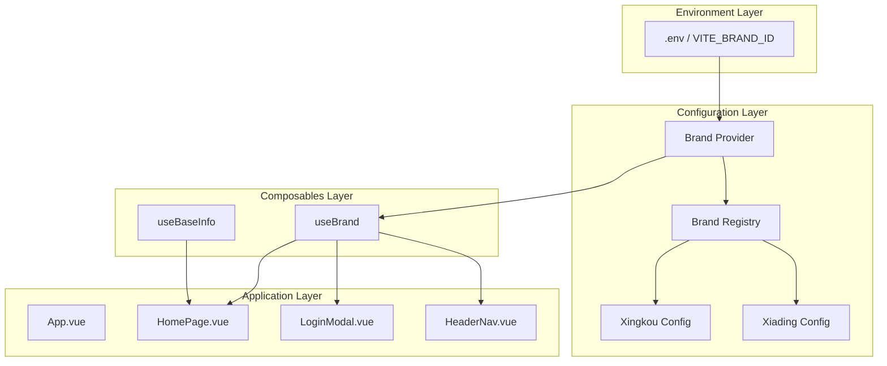
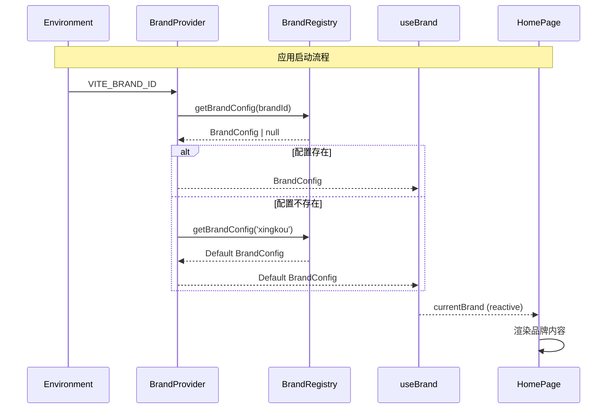

# Design Document: Multi-Brand Architecture

## Overview

本设计文档描述多品牌/多域名架构系统的技术实现方案。该系统采用配置驱动的架构模式，通过环境变量和品牌注册表实现多品牌支持，使同一套代码库能够服务于不同品牌的网站。

核心设计原则：
1. **配置驱动** - 品牌差异通过配置而非代码分支实现
2. **类型安全** - 使用 TypeScript 确保配置结构正确性
3. **单一数据源** - 品牌配置集中管理，避免分散
4. **向后兼容** - 默认行为与现有星扣品牌保持一致

## Architecture



### 数据流



## Components and Interfaces

### 1. Brand Configuration Types (`src/types/brand.ts`)

```typescript
/**
 * 品牌主题配置
 */
export interface BrandThemeConfig {
  /** 主色调 */
  primaryColor: string
  /** 辅助色 */
  secondaryColor: string
  /** CTA按钮色 */
  ctaColor: string
  /** 背景色 */
  backgroundColor: string
  /** 文字色 */
  textColor: string
  /** Logo路径 */
  logoPath: string
  /** Logo替代文本 */
  logoAlt: string
}

/**
 * Hero区域配置
 */
export interface BrandHeroConfig {
  /** 主标题 */
  title: string
  /** 副标题 */
  subtitle: string
  /** 主按钮文案 */
  primaryButtonText: string
  /** 次按钮文案 */
  secondaryButtonText: string
  /** 亮点列表 */
  highlights: string[]
}

/**
 * 页脚配置
 */
export interface BrandFooterConfig {
  /** 版权信息 */
  copyright: string
  /** 联系信息 */
  contactInfo: {
    phone?: string
    email?: string
    wechat?: string
  }
  /** 导航分组 */
  navigation: Array<{
    title: string
    links: Array<{ text: string; url: string }>
  }>
}

/**
 * 完整品牌配置
 */
export interface BrandConfig {
  /** 品牌唯一标识 */
  id: string
  /** 品牌显示名称 */
  name: string
  /** 登录URL */
  loginUrl: string
  /** 主题配置 */
  theme: BrandThemeConfig
  /** Hero区配置 */
  hero: BrandHeroConfig
  /** 页脚配置 */
  footer: BrandFooterConfig
}

/**
 * 品牌ID类型（限定有效值）
 */
export type BrandId = 'xingkou' | 'xiading'
```

### 2. Brand Registry (`src/config/brandRegistry.ts`)

```typescript
import type { BrandConfig, BrandId } from '@/types/brand'

/**
 * 品牌注册表 - 存储所有品牌配置
 */
const brandRegistry: Record<BrandId, BrandConfig> = {
  xingkou: {
    id: 'xingkou',
    name: '星扣AR创作平台·教育版',
    loginUrl: 'https://edu.xingkou.com/login',
    theme: {
      primaryColor: '#1E40AF',
      secondaryColor: '#2563EB',
      ctaColor: '#22C55E',
      backgroundColor: '#EFF6FF',
      textColor: '#1E3A8A',
      logoPath: '/images/xingkou-logo.svg',
      logoAlt: '星扣AR教育版'
    },
    hero: {
      title: '星扣AR创作平台 — 让知识"立"起来，让创意"活"起来',
      subtitle: '专为教育场景打造的AR内容创作平台...',
      primaryButtonText: '立即开始创作',
      secondaryButtonText: '查看教学案例',
      highlights: ['课本变立体', '实验零风险', '创意可落地', '知识可互动']
    },
    footer: {
      copyright: '© 2024 星扣科技 版权所有',
      contactInfo: { phone: '400-xxx-xxxx', email: 'edu@xingkou.com' },
      navigation: [/* ... */]
    }
  },
  xiading: {
    id: 'xiading',
    name: '夏鼎',
    loginUrl: 'https://xiading.com/login',
    theme: {
      primaryColor: '#B45309',
      secondaryColor: '#D97706',
      ctaColor: '#059669',
      backgroundColor: '#FFFBEB',
      textColor: '#78350F',
      logoPath: '/images/xiading-logo.svg',
      logoAlt: '夏鼎'
    },
    hero: {
      title: '夏鼎 — 传承文化，创新未来',
      subtitle: '专注于文化遗产数字化保护与展示...',
      primaryButtonText: '开始探索',
      secondaryButtonText: '了解更多',
      highlights: ['文物数字化', '沉浸式体验', '文化传承', '创新展示']
    },
    footer: {
      copyright: '© 2024 夏鼎科技 版权所有',
      contactInfo: { phone: '400-xxx-xxxx', email: 'contact@xiading.com' },
      navigation: [/* ... */]
    }
  }
}

/**
 * 获取品牌配置
 */
export function getBrandConfig(brandId: string): BrandConfig | null {
  if (brandId in brandRegistry) {
    return brandRegistry[brandId as BrandId]
  }
  return null
}

/**
 * 获取所有品牌ID
 */
export function getAllBrandIds(): BrandId[] {
  return Object.keys(brandRegistry) as BrandId[]
}

/**
 * 检查品牌ID是否有效
 */
export function isValidBrandId(brandId: string): brandId is BrandId {
  return brandId in brandRegistry
}

export { brandRegistry }
```

### 3. Brand Provider (`src/config/brandProvider.ts`)

```typescript
import { getBrandConfig, isValidBrandId } from './brandRegistry'
import type { BrandConfig } from '@/types/brand'

const DEFAULT_BRAND_ID = 'xingkou'

/**
 * 获取当前品牌配置
 * 从环境变量读取品牌ID，返回对应配置
 */
export function getCurrentBrandConfig(): BrandConfig {
  const brandId = import.meta.env.VITE_BRAND_ID || DEFAULT_BRAND_ID
  
  if (!isValidBrandId(brandId)) {
    console.warn(
      `[BrandProvider] Invalid brand ID: "${brandId}", falling back to "${DEFAULT_BRAND_ID}"`
    )
    return getBrandConfig(DEFAULT_BRAND_ID)!
  }
  
  return getBrandConfig(brandId)!
}

/**
 * 获取当前品牌ID
 */
export function getCurrentBrandId(): string {
  const brandId = import.meta.env.VITE_BRAND_ID || DEFAULT_BRAND_ID
  return isValidBrandId(brandId) ? brandId : DEFAULT_BRAND_ID
}
```

### 4. useBrand Composable (`src/composables/useBrand.ts`)

```typescript
import { computed, readonly } from 'vue'
import { getCurrentBrandConfig, getCurrentBrandId } from '@/config/brandProvider'
import type { BrandConfig } from '@/types/brand'

/**
 * useBrand composable
 * 提供当前品牌配置的响应式访问
 */
export function useBrand() {
  // 品牌配置在应用生命周期内不变，使用computed缓存
  const brandConfig = computed<BrandConfig>(() => getCurrentBrandConfig())
  const brandId = computed<string>(() => getCurrentBrandId())
  
  // 便捷访问器
  const theme = computed(() => brandConfig.value.theme)
  const hero = computed(() => brandConfig.value.hero)
  const footer = computed(() => brandConfig.value.footer)
  const loginUrl = computed(() => brandConfig.value.loginUrl)
  const brandName = computed(() => brandConfig.value.name)
  
  return {
    brandConfig: readonly(brandConfig),
    brandId: readonly(brandId),
    theme: readonly(theme),
    hero: readonly(hero),
    footer: readonly(footer),
    loginUrl: readonly(loginUrl),
    brandName: readonly(brandName)
  }
}
```

### 5. Updated HomePage.vue (关键变更)

```vue
<script setup lang="ts">
import { useBrand } from '@/composables/useBrand'

// 获取品牌配置
const { hero, footer, loginUrl, theme } = useBrand()

// Hero配置现在从品牌配置获取
const heroConfig = computed(() => ({
  title: hero.value.title,
  subtitle: hero.value.subtitle,
  primaryButton: hero.value.primaryButtonText,
  secondaryButton: hero.value.secondaryButtonText,
  highlights: hero.value.highlights
}))
</script>
```

## Data Models

### Brand Configuration Schema

```typescript
// JSON Schema for BrandConfig validation
const BrandConfigSchema = {
  type: 'object',
  required: ['id', 'name', 'loginUrl', 'theme', 'hero', 'footer'],
  properties: {
    id: { type: 'string', minLength: 1 },
    name: { type: 'string', minLength: 1 },
    loginUrl: { type: 'string', format: 'uri' },
    theme: {
      type: 'object',
      required: ['primaryColor', 'logoPath'],
      properties: {
        primaryColor: { type: 'string', pattern: '^#[0-9A-Fa-f]{6}$' },
        secondaryColor: { type: 'string', pattern: '^#[0-9A-Fa-f]{6}$' },
        ctaColor: { type: 'string', pattern: '^#[0-9A-Fa-f]{6}$' },
        backgroundColor: { type: 'string', pattern: '^#[0-9A-Fa-f]{6}$' },
        textColor: { type: 'string', pattern: '^#[0-9A-Fa-f]{6}$' },
        logoPath: { type: 'string' },
        logoAlt: { type: 'string' }
      }
    },
    hero: {
      type: 'object',
      required: ['title', 'subtitle'],
      properties: {
        title: { type: 'string' },
        subtitle: { type: 'string' },
        primaryButtonText: { type: 'string' },
        secondaryButtonText: { type: 'string' },
        highlights: { type: 'array', items: { type: 'string' } }
      }
    },
    footer: {
      type: 'object',
      properties: {
        copyright: { type: 'string' },
        contactInfo: { type: 'object' },
        navigation: { type: 'array' }
      }
    }
  }
}
```

### Environment Variables

```bash
# .env.example 新增
# 品牌标识 - 可选值: xingkou, xiading
VITE_BRAND_ID=xingkou
```


## Correctness Properties

*A property is a characteristic or behavior that should hold true across all valid executions of a system—essentially, a formal statement about what the system should do. Properties serve as the bridge between human-readable specifications and machine-verifiable correctness guarantees.*

### Property 1: Brand Configuration Structure Completeness

*For any* brand configuration in the Brand_Registry, the configuration object SHALL contain all required fields: id, name, loginUrl, theme (with primaryColor, logoPath), hero (with title, subtitle), and footer (with copyright).

**Validates: Requirements 2.1, 5.1, 5.2, 6.1, 6.2**

### Property 2: Valid Brand ID Query Returns Configuration

*For any* valid brand ID that exists in the Brand_Registry, calling `getBrandConfig(brandId)` SHALL return a non-null BrandConfig object with the matching id field.

**Validates: Requirements 2.2, 3.2**

### Property 3: Invalid Brand ID Returns Null

*For any* string that is not a registered brand ID, calling `getBrandConfig(invalidId)` SHALL return null.

**Validates: Requirements 2.3**

### Property 4: Invalid Environment Variable Falls Back to Default

*For any* invalid brand ID string set in `VITE_BRAND_ID`, the Brand_Provider SHALL return the default brand configuration ('xingkou') and the returned config's id SHALL equal 'xingkou'.

**Validates: Requirements 1.3**

### Property 5: Brand Configuration Serialization Round-Trip

*For any* valid BrandConfig object, serializing it to JSON and then deserializing SHALL produce an object that is deeply equal to the original.

**Validates: Requirements 8.1**

### Property 6: Invalid JSON Parsing Error

*For any* string that is not valid JSON, attempting to parse it as a BrandConfig SHALL throw a parsing error.

**Validates: Requirements 8.3**

### Property 7: Missing Optional Fields Use Defaults

*For any* brand configuration where optional content fields are undefined, the Home_Page_View SHALL render without errors and either display default values or hide the corresponding elements.

**Validates: Requirements 6.4**

## Error Handling

### Environment Variable Errors

| Error Condition | Handling Strategy | User Impact |
|-----------------|-------------------|-------------|
| `VITE_BRAND_ID` 未设置 | 使用默认值 'xingkou' | 无感知，正常显示星扣品牌 |
| `VITE_BRAND_ID` 设置为无效值 | 回退到 'xingkou'，控制台警告 | 无感知，开发者可通过控制台发现问题 |
| 品牌配置缺少必填字段 | TypeScript 编译错误 | 开发阶段发现，无法构建 |

### Runtime Errors

| Error Condition | Handling Strategy | Recovery |
|-----------------|-------------------|----------|
| 登录URL为空 | 显示错误提示，阻止跳转 | 用户可联系管理员 |
| Logo图片加载失败 | 显示品牌名称文字作为降级 | 自动降级 |
| 主题颜色格式错误 | 使用CSS默认值 | 自动降级 |

### Error Logging

```typescript
// 错误日志格式
interface BrandError {
  code: 'INVALID_BRAND_ID' | 'MISSING_CONFIG' | 'INVALID_LOGIN_URL'
  message: string
  brandId?: string
  timestamp: number
}

// 示例
console.warn('[BrandProvider]', {
  code: 'INVALID_BRAND_ID',
  message: `Invalid brand ID: "${brandId}", falling back to default`,
  brandId,
  timestamp: Date.now()
})
```

## Testing Strategy

### Dual Testing Approach

本项目采用单元测试和属性测试相结合的测试策略：

- **单元测试**: 验证具体示例、边界条件和错误处理
- **属性测试**: 验证跨所有输入的通用属性

### Property-Based Testing Configuration

- **测试库**: fast-check (TypeScript 属性测试库)
- **最小迭代次数**: 100 次/属性
- **标签格式**: `Feature: multi-brand-architecture, Property N: {property_text}`

### Test Categories

#### Unit Tests (具体示例)

1. **默认品牌测试**
   - 验证 'xingkou' 品牌配置存在且完整
   - 验证 'xiading' 品牌配置存在且完整
   - _Requirements: 2.4_

2. **环境变量边界测试**
   - 空字符串环境变量 → 默认品牌
   - undefined 环境变量 → 默认品牌
   - _Requirements: 1.2_

3. **CSS变量应用测试**
   - 验证主题颜色正确设置为CSS变量
   - _Requirements: 5.4_

#### Property Tests (通用属性)

1. **配置完整性属性测试**
   - 生成器: 从 Brand_Registry 随机选择品牌
   - 断言: 所有必填字段存在且类型正确
   - **Feature: multi-brand-architecture, Property 1: Brand Configuration Structure Completeness**

2. **查询一致性属性测试**
   - 生成器: 随机有效品牌ID
   - 断言: 查询结果的 id 字段与查询参数匹配
   - **Feature: multi-brand-architecture, Property 2: Valid Brand ID Query Returns Configuration**

3. **无效ID处理属性测试**
   - 生成器: 随机字符串（排除有效品牌ID）
   - 断言: 返回值为 null
   - **Feature: multi-brand-architecture, Property 3: Invalid Brand ID Returns Null**

4. **序列化 Round-Trip 属性测试**
   - 生成器: 随机有效 BrandConfig 对象
   - 断言: `JSON.parse(JSON.stringify(config))` 深度等于原对象
   - **Feature: multi-brand-architecture, Property 5: Brand Configuration Serialization Round-Trip**

### Test File Structure

```
src/
├── config/
│   ├── __tests__/
│   │   ├── brandRegistry.spec.ts      # 单元测试
│   │   ├── brandProvider.spec.ts      # 单元测试
│   │   └── brandConfig.property.ts    # 属性测试
├── composables/
│   ├── __tests__/
│   │   └── useBrand.spec.ts           # 单元测试
```

### Test Dependencies

```json
{
  "devDependencies": {
    "vitest": "^1.0.0",
    "fast-check": "^3.0.0",
    "@vue/test-utils": "^2.4.0"
  }
}
```

