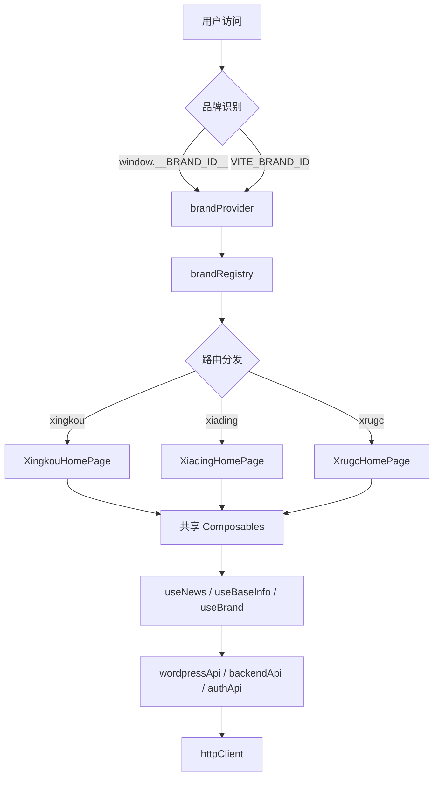
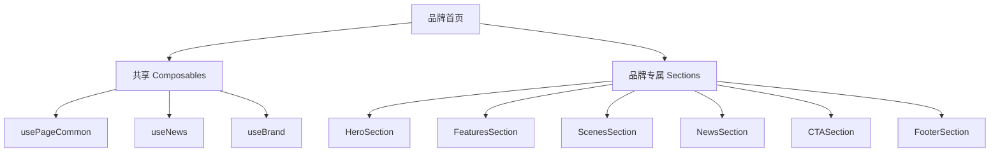
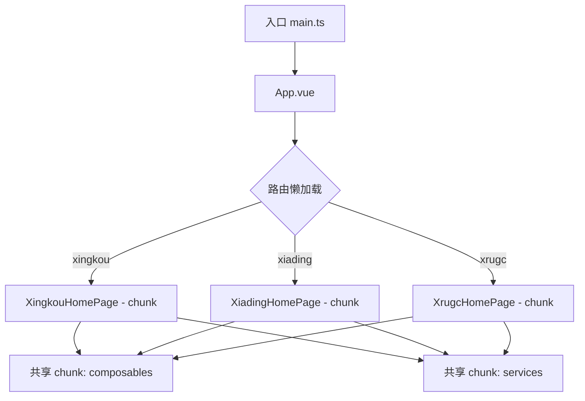
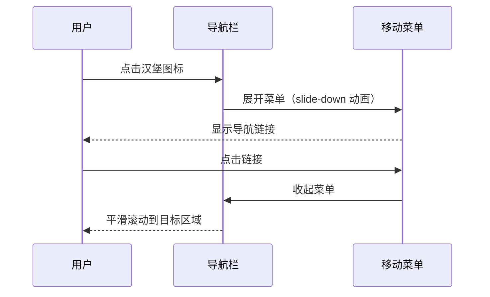
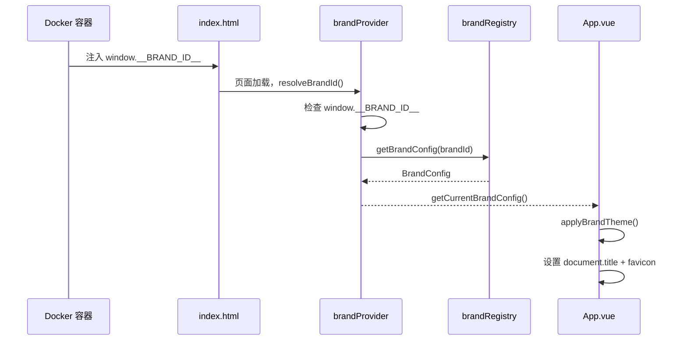
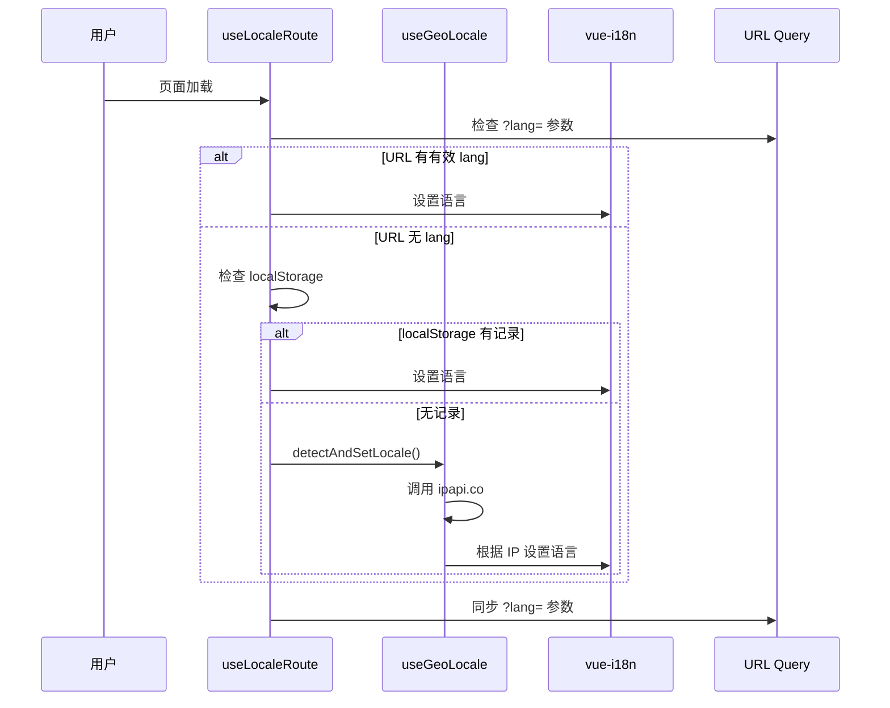

# 设计文档：项目改进（Project Improvements）

## 概述

本文档整理了教育AR创作平台当前代码库的系统性改进方向。通过对三个品牌（星扣、夏鼎、XRUGC）的首页实现、多品牌架构、国际化系统、服务层及工程化配置的全面分析，识别出五大改进领域：代码架构优化、多品牌系统改进、性能优化、用户体验提升、开发体验改进。

当前项目已具备良好的基础架构（Vue 3 + TypeScript + 多品牌注册表 + Docker 运行时注入），但随着品牌数量增加和功能迭代，存在代码重复、类型安全漏洞、i18n 键缺失、性能瓶颈等问题需要系统性解决。

---

## 架构总览



---

## 改进领域一：代码架构优化

### 1.1 当前问题分析

**问题：三个品牌首页存在大量重复代码**

三个首页（XingkouHomePage、XiadingHomePage、XrugcHomePage）各自独立实现了以下相同逻辑：
- 滚动动画检测（`handleScroll` + `animatedSections` + `isInViewport`）
- 新闻弹窗（`showNewsModal` + `selectedNews` + `handleOpenNewsDetail`）
- 登录弹窗触发（`showLoginModal` + `handleOpenLogin`）
- 日期格式化（`formatDate`）
- 博客地址计算（`blogUrl`）
- 版本号读取（`version`、`buildTime`）

**问题：类型安全漏洞**

```typescript
// 当前：大量 any 类型使用
const selectedNews = ref<any>(null)
const version = (window as any).__APP_VERSION__ || '1.0.0'
const injected = (window as any).__BRAND_ID__
```

**问题：authApi 中 i18n 导入方式不规范**

```typescript
// 当前：直接导入 i18n 实例，绕过 Composition API
import i18n from "@/i18n";
const friendlyMessage = (msg: string): string => {
  return (i18n.global as any).t(key);
}
```

**问题：XrugcHomePage 存在大量 i18n 键缺失**

诊断工具显示 60+ 个 i18n 键在 `en.ts` 中不存在（实际上键已存在，但类型推断报错），根本原因是 `useLocaleRoute` 的 `defaultLocale` 参数类型不匹配（传入 `'en'` 而非 `'en-US'`）。

### 1.2 架构改进设计

#### 共享 Composable：usePageCommon

```typescript
interface UsePageCommonReturn {
  // 状态
  showLoginModal: Ref<boolean>
  showNewsModal: Ref<boolean>
  selectedNews: Ref<NewsItem | null>
  navScrolled: Ref<boolean>
  animatedSections: Ref<Set<HTMLElement>>
  // 计算属性
  blogUrl: ComputedRef<string>
  version: ComputedRef<string>
  buildTime: ComputedRef<string>
  // 方法
  handleOpenLogin: () => void
  handleOpenNewsDetail: (item: NewsItem) => void
  handleScroll: () => void
  formatDate: (dateString: string, locale?: string) => string
  // 生命周期（自动注册）
  // onMounted: 注册 scroll 监听 + 触发初始检测
  // onUnmounted: 移除 scroll 监听
}
```

#### 运行时配置类型安全

```typescript
// src/types/runtime.ts
interface RuntimeConfig {
  __BRAND_ID__?: string
  __WORDPRESS_API_URL__?: string
  __API_URL__?: string
  __BACKUP_API_URL__?: string
  __WORKBENCH_URL__?: string
  __APP_VERSION__?: string
  __BUILD_TIME__?: string
}

declare global {
  interface Window extends RuntimeConfig {}
}

// 类型安全的访问函数
export function getRuntimeConfig(): RuntimeConfig {
  return {
    __BRAND_ID__: window.__BRAND_ID__,
    __WORDPRESS_API_URL__: window.__WORDPRESS_API_URL__,
    // ...
  }
}
```

#### 组件拆分策略



---

## 改进领域二：多品牌系统改进

### 2.1 当前问题分析

**问题：品牌配置与页面内容耦合**

`brandRegistry.ts` 中的 `hero`、`footer` 配置与实际页面内容脱节——三个首页都直接在组件内硬编码了内容数据（`navItems`、`featureItems`、`sceneItems`、`caseItems`），而非从品牌配置读取。

**问题：SKILL.md 与实际实现不一致**

SKILL.md 描述的路由前缀（`/xiading`、`/en`）与实际实现（单路由 `/`，通过 Docker 环境变量区分品牌）不符。

**问题：夏鼎品牌使用外部 Unsplash 图片**

```typescript
// XiadingHomePage.vue - 依赖外部图片服务
const heroImages = [
  'https://images.unsplash.com/photo-1535223289827-42f1e9919769?w=1920&q=80',
  // ...
]
```

**问题：品牌配置中联系信息为占位符**

```typescript
// brandRegistry.ts
contactInfo: {
  phone: '400-xxx-xxxx',  // 占位符，未填写真实信息
  email: 'edu@xingkou.com',
}
```

### 2.2 多品牌改进设计

#### 品牌内容配置扩展

```typescript
// 扩展 BrandConfig 接口
interface BrandConfig {
  // 现有字段...
  
  // 新增：页面内容配置
  content?: {
    nav?: NavItem[]
    features?: FeatureItem[]
    scenes?: SceneItem[]
    cases?: CaseItem[]
    stats?: StatItem[]
  }
  
  // 新增：联系方式（完整）
  contact: {
    phone: string
    email: string
    wechat?: string
    address?: string
  }
  
  // 新增：SEO 配置
  seo?: {
    title: string
    description: string
    keywords: string[]
    ogImage?: string
  }
}
```

#### 品牌资源本地化

```mermaid
graph LR
    A[夏鼎 Hero] -->|当前| B[Unsplash 外部图片]
    A -->|改进后| C[/images/ar-platform/ 本地图片]
    D[星扣 Hero] --> C
    E[XRUGC Hero] --> C
```

---

## 改进领域三：性能优化

### 3.1 当前问题分析

**问题：首页组件体积过大**

- `XingkouHomePage.vue`：1788 行（脚本 + 模板 + 样式全部内联）
- `XiadingHomePage.vue`：1022 行
- `XrugcHomePage.vue`：完整实现，样式高度压缩但仍较大

**问题：图片未优化**

- 所有图片使用 `.webp` 格式（已较好），但缺少 `loading="lazy"` 属性（部分已有）
- 缺少 `width`/`height` 属性导致 CLS（累积布局偏移）
- 夏鼎首页 Hero 图片从 Unsplash 加载（`w=1920&q=80`），无缓存控制

**问题：Google Fonts 阻塞渲染**

```scss
// XiadingHomePage.vue 和 XrugcHomePage.vue
@import url('https://fonts.googleapis.com/css2?family=Zen+Kaku+Gothic+New...');
```

**问题：分类缓存策略简单**

```typescript
// wordpressApi.ts - 模块级变量缓存，无过期机制
let categoriesCache: Map<number, NewsCategory> | null = null;
```

**问题：WordPress API 无请求去重**

多个组件同时挂载时可能发起重复的 API 请求。

### 3.2 性能优化设计

#### 代码分割策略



当前路由已使用动态 `import()`，但可进一步优化 chunk 分组。

#### 图片优化策略

```typescript
// 图片组件接口设计
interface OptimizedImageProps {
  src: string
  alt: string
  width?: number
  height?: number
  loading?: 'lazy' | 'eager'
  fetchpriority?: 'high' | 'low' | 'auto'
}
```

#### WordPress API 请求优化

```typescript
// 改进：添加请求去重 + TTL 缓存
interface CacheEntry<T> {
  data: T
  timestamp: number
  ttl: number  // 毫秒
}

class ApiCache {
  private cache = new Map<string, CacheEntry<unknown>>()
  private pending = new Map<string, Promise<unknown>>()
  
  async get<T>(key: string, fetcher: () => Promise<T>, ttl = 300_000): Promise<T>
}
```

#### 字体加载优化

```html
<!-- index.html - 预连接 + 预加载 -->
<link rel="preconnect" href="https://fonts.googleapis.com">
<link rel="preconnect" href="https://fonts.gstatic.com" crossorigin>
<link rel="preload" as="style" href="https://fonts.googleapis.com/css2?...">
```

---

## 改进领域四：用户体验提升

### 4.1 当前问题分析

**问题：移动端导航缺失**

三个品牌首页的导航栏在移动端（`< 768px`）均通过 `display: none` 隐藏了导航链接，但没有提供汉堡菜单替代方案。

**问题：新闻弹窗无键盘导航支持**

```html
<!-- 当前：自定义弹窗，无 ARIA 属性 -->
<div v-if="showNewsModal" class="news-modal-overlay" @click.self="showNewsModal = false">
  <div class="news-modal-container">
    <!-- 缺少 role="dialog", aria-modal, aria-labelledby -->
```

**问题：登录弹窗在移动端未全屏**

SKILL.md 要求"移动端全屏"，但当前 `LoginModal.vue` 使用固定 `width="420px"`，未针对移动端适配。

**问题：滚动动画在低性能设备上可能卡顿**

当前使用 `scroll` 事件 + `getBoundingClientRect()`，未使用 `IntersectionObserver`。

**问题：缺少 `prefers-reduced-motion` 支持**

XRUGC 首页有 `@media (prefers-reduced-motion: reduce)` 处理，但星扣和夏鼎首页缺失。

### 4.2 用户体验改进设计

#### 移动端导航方案



#### 无障碍改进

```typescript
// 新闻弹窗 ARIA 规范
interface NewsModalProps {
  visible: boolean
  news: NewsItem | null
}
// 模板要求：
// role="dialog"
// aria-modal="true"
// aria-labelledby="news-modal-title"
// 焦点陷阱（focus trap）
// ESC 键关闭
```

#### 登录弹窗移动端适配

```scss
// LoginModal 移动端全屏
@media (max-width: 768px) {
  :deep(.el-dialog) {
    width: 100% !important;
    max-width: 100%;
    margin: 0;
    border-radius: 0;
    height: 100vh;
  }
}
```

#### IntersectionObserver 替代 scroll 事件

```typescript
// useScrollAnimation composable
function useScrollAnimation(threshold = 0.15) {
  const observer = new IntersectionObserver(
    (entries) => {
      entries.forEach(entry => {
        if (entry.isIntersecting) {
          entry.target.classList.add('animated')
          observer.unobserve(entry.target)
        }
      })
    },
    { threshold }
  )
  
  const observe = (el: HTMLElement) => observer.observe(el)
  const disconnect = () => observer.disconnect()
  
  onUnmounted(disconnect)
  return { observe }
}
```

---

## 改进领域五：开发体验改进

### 5.1 当前问题分析

**问题：缺少测试配置**

`package.json` 中 `pnpm test` 命令存在但无测试框架配置，CI/CD 中 `pnpm test || true` 忽略了测试失败。

**问题：缺少 lint 配置**

`pnpm run lint || true` 同样忽略了 lint 错误，且未见 ESLint 配置文件。

**问题：CI/CD 构建参数不完整**

```yaml
# 当前：只传入 VITE_BACKEND_API_URL
build-args: |
  VITE_BACKEND_API_URL=${{ secrets.VITE_BACKEND_API_URL }}
# 缺少：VITE_WORDPRESS_API_URL 等其他构建时变量
```

**问题：docker-entrypoint.sh 存在注入安全风险**

```sh
# 当前：直接字符串插值，若变量包含特殊字符（如单引号）会破坏 JS 语法
sed -i "s|<head>|<head><script>window.__BRAND_ID__='${BRAND_ID}';</script>|"
```

**问题：缺少 `.env.example` 完整说明**

**问题：SCSS 变量重复定义**

品牌首页组件内部重复定义了与 `_variables.scss` 相同的 SCSS 变量（如 `XingkouHomePage.vue` 内定义了完整的 `$primary`、`$spacing-*` 等变量集），未复用全局变量文件。

### 5.2 开发体验改进设计

#### 测试框架接入

```typescript
// vitest.config.ts
import { defineConfig } from 'vitest/config'
import vue from '@vitejs/plugin-vue'

export default defineConfig({
  plugins: [vue()],
  test: {
    environment: 'jsdom',
    globals: true,
    coverage: {
      provider: 'v8',
      reporter: ['text', 'lcov'],
    }
  }
})
```

关键测试用例：
- `brandRegistry` 配置完整性验证
- `wordpressApi` 数据转换函数单元测试
- `authApi` 健康检查与故障转移逻辑
- `useLocaleRoute` URL 参数同步行为

#### ESLint 配置

```json
// eslint.config.js（flat config）
{
  "extends": ["@vue/eslint-config-typescript"],
  "rules": {
    "@typescript-eslint/no-explicit-any": "warn",
    "vue/component-name-in-template-casing": ["error", "PascalCase"]
  }
}
```

#### docker-entrypoint.sh 安全改进

```sh
# 改进：使用 JSON 序列化避免注入风险
BRAND_ID_JSON=$(printf '%s' "${BRAND_ID}" | python3 -c "import json,sys; print(json.dumps(sys.stdin.read()))")
CONFIG_SCRIPT="<script>window.__BRAND_ID__=${BRAND_ID_JSON};</script>"
```

或改用 `envsubst` + 模板文件方式注入。

#### SCSS 变量统一

```scss
// 品牌首页应通过 @use 引入品牌变量，而非重复定义
// XingkouHomePage.vue <style>
@use '@/assets/styles/xingkou/variables' as xk;

.hero__title {
  color: xk.$primary;
}
```

---

## 关键数据流

### 品牌初始化流程



### 语言检测流程（XRUGC）



---

## 错误处理策略

### 当前错误处理现状

| 模块 | 当前策略 | 问题 |
|------|----------|------|
| wordpressApi | 静默失败，返回 `[]` | 无法区分网络错误和空数据 |
| backendApi | 降级到默认值 | 合理，但错误日志不够结构化 |
| authApi | 主备切换 + 重试 | 较完善，但缓存无过期机制 |
| useNews | 显示错误信息 + 重试按钮 | 较完善 |
| useBaseInfo | 静默降级 | 合理 |

### 改进后错误处理

```typescript
// 统一错误类型
type ApiErrorCode = 
  | 'NETWORK_ERROR'
  | 'SERVER_ERROR'
  | 'NOT_FOUND'
  | 'UNAUTHORIZED'
  | 'TIMEOUT'
  | 'UNKNOWN'

interface StructuredError {
  code: ApiErrorCode
  message: string
  retryable: boolean
  timestamp: number
}
```

---

## 测试策略

### 单元测试覆盖目标

| 模块 | 测试重点 | 优先级 |
|------|----------|--------|
| `brandRegistry` | 所有品牌配置字段完整性 | 高 |
| `brandProvider` | 品牌 ID 解析优先级 | 高 |
| `wordpressApi` | `transformPost` 数据转换 | 高 |
| `authApi` | 健康检查 + 故障转移 | 高 |
| `useLocaleRoute` | URL 参数同步 | 中 |
| `useGeoLocale` | 国家代码映射 | 中 |
| `useNews` | 加载/错误/重试状态 | 中 |

### 属性测试（Property-Based Testing）

```typescript
// 使用 fast-check 验证品牌配置不变量
fc.assert(
  fc.property(
    fc.constantFrom('xingkou', 'xiading', 'xrugc'),
    (brandId) => {
      const config = getBrandConfig(brandId)
      return config !== null
        && config.theme.primaryColor.startsWith('#')
        && config.locale.length === 5  // 'zh-CN' 格式
    }
  )
)
```

---

## 安全考量

### 当前安全问题

1. **XSS 风险**：`docker-entrypoint.sh` 直接字符串插值注入 JS，若环境变量包含 `'` 或 `</script>` 会破坏页面
2. **Token 存储**：`authApi` 将 `accessToken` 存储在 `localStorage`（XSS 可读取），建议评估 `httpOnly Cookie` 方案
3. **新闻内容 XSS**：`v-html="selectedNews.content"` 直接渲染 WordPress 返回的 HTML，需要 DOMPurify 净化

### 安全改进

```typescript
// 安装 DOMPurify
import DOMPurify from 'dompurify'

// 在渲染 WordPress 内容前净化
const sanitizedContent = computed(() => 
  DOMPurify.sanitize(selectedNews.value?.content ?? '')
)
```

---

## 依赖关系

### 当前依赖

| 包 | 版本 | 用途 |
|----|------|------|
| vue | ^3.5.13 | 核心框架 |
| vue-router | ^4.6.4 | 路由 |
| vue-i18n | ^9.14.5 | 国际化 |
| element-plus | ^2.13.2 | UI 组件库 |
| axios | ^1.13.4 | HTTP 客户端 |
| sass | ^1.97.3 | CSS 预处理器 |

### 建议新增依赖

| 包 | 用途 | 优先级 |
|----|------|--------|
| vitest | 单元测试框架 | 高 |
| @vue/test-utils | Vue 组件测试 | 高 |
| dompurify | XSS 防护 | 高 |
| @types/dompurify | DOMPurify 类型 | 高 |
| eslint + @vue/eslint-config-typescript | 代码规范 | 中 |
| @vitest/coverage-v8 | 测试覆盖率 | 中 |


---

## 正确性属性

*属性是在系统所有有效执行中应保持为真的特征或行为——本质上是关于系统应做什么的形式化陈述。属性是人类可读规范与机器可验证正确性保证之间的桥梁。*

### 属性 1：formatDate 对有效日期的健壮性

*对任意*有效的 ISO 日期字符串，调用 `formatDate` 应返回非空字符串，且不抛出异常。

**验证：需求 1.5**

---

### 属性 2：ApiCache 请求去重与 TTL 幂等性

*对任意* URL 键，在 TTL 有效期内多次调用 `ApiCache.get` 应只发起一次实际网络请求，且每次返回相同的数据结果。当 TTL 过期后，下次调用应重新发起网络请求。

**验证：需求 7.1、7.2、7.3、15.6、16.4**

---

### 属性 3：图片元素属性完整性

*对任意*品牌首页（XingkouHomePage、XiadingHomePage、XrugcHomePage）渲染输出中的 `` 元素，每个元素都应具有非空的 `alt` 属性、明确的 `width` 属性和 `height` 属性。

**验证：需求 8.3、8.4**

---

### 属性 4：汉堡菜单 ARIA 状态一致性

*对任意*移动端导航菜单的展开/收起状态，汉堡图标的 `aria-expanded` 属性值应与菜单的实际可见状态保持一致（展开时为 `"true"`，收起时为 `"false"`）。

**验证：需求 10.4、10.5**

---

### 属性 5：IntersectionObserver 动画触发行为

*对任意*被 UseScrollAnimation 观察的 HTML 元素，当该元素进入视口时，应被添加 `animated` CSS 类，且随后该元素应停止被观察（`unobserve` 被调用）。

**验证：需求 13.2、13.3**

---

### 属性 6：brandRegistry 配置完整性

*对任意*有效品牌 ID（`'xingkou'`、`'xiading'`、`'xrugc'`），`getBrandConfig` 应返回非空配置对象，且该对象的 `theme.primaryColor` 以 `#` 开头，`locale` 字段为非空字符串。

**验证：需求 15.1、16.2**

---

### 属性 7：brandProvider 品牌 ID 解析优先级

*对任意* `window.__BRAND_ID__`、`VITE_BRAND_ID` 环境变量和默认值的组合，`BrandProvider` 解析品牌 ID 的优先级应始终满足：`window.__BRAND_ID__` > `VITE_BRAND_ID` > 默认值。

**验证：需求 15.2**

---

### 属性 8：wordpressApi transformPost 数据转换完整性

*对任意*符合 WordPress REST API 格式的有效文章响应对象，`transformPost` 函数应返回包含 `id`、`title`、`content`、`date`、`excerpt` 字段的 `NewsItem` 对象，且不抛出异常。

**验证：需求 15.3、16.3**

---

### 属性 9：useLocaleRoute URL 参数同步

*对任意*有效的语言代码（`'zh-CN'`、`'zh-TW'`、`'en'`、`'ja'`、`'th'`），调用 `useLocaleRoute` 设置语言后，URL 的 `?lang=` 参数应与当前语言保持一致。

**验证：需求 15.5**

---

### 属性 10：DOMPurify 净化新闻内容安全性

*对任意*包含潜在恶意 HTML 标签（如 `<script>`、`<iframe>`、`onerror` 事件属性）的新闻内容字符串，经 `DOMPurify.sanitize()` 处理后，渲染结果不应包含可执行的脚本代码。

**验证：需求 19.2**

---

### 属性 11：DockerEntrypoint 特殊字符安全注入

*对任意*包含单引号、双引号、反斜杠或 `</script>` 字符串的环境变量值，`docker-entrypoint.sh` 注入后生成的 JavaScript 代码应为语法合法的 JS，且不包含可被利用的注入点。

**验证：需求 18.1、18.2**
